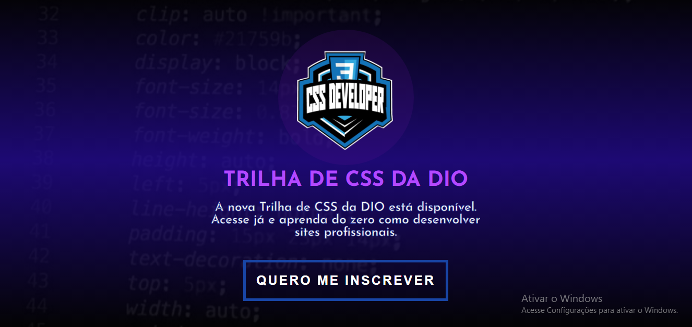

<h1 align="center"> Trilha de CSS </h1>

Landing Page da Trilha de CSS da DIO 

  <a href="#-tecnologias">Tecnologias</a>&nbsp;&nbsp;&nbsp;|&nbsp;&nbsp;&nbsp;
  <a href="#-projeto">Projeto</a>&nbsp;&nbsp;&nbsp;|&nbsp;&nbsp;&nbsp;
  <a href="#-deploy">Deploy</a>&nbsp;&nbsp;&nbsp;|&nbsp;&nbsp;&nbsp;

 

  

## 🚀 Tecnologias

Esse projeto foi desenvolvido com as seguintes tecnologias:

- HTML e CSS
- Git e Github

## 💻 Projeto

Landing page para a Trilha de CSS da DIO, com um design atraente e funcional que comunica a essência do curso.
Desenvolver um site que informe de forma clara e impactante sobre a trilha de aprendizado, incentivando mais pessoas a mergulharem no mundo do CSS.
## 🔗 Deploy

Link: https://gh0stbl4ck.github.io/LandingPage/

---

Feito por Guilherme Lins Oliveira.
